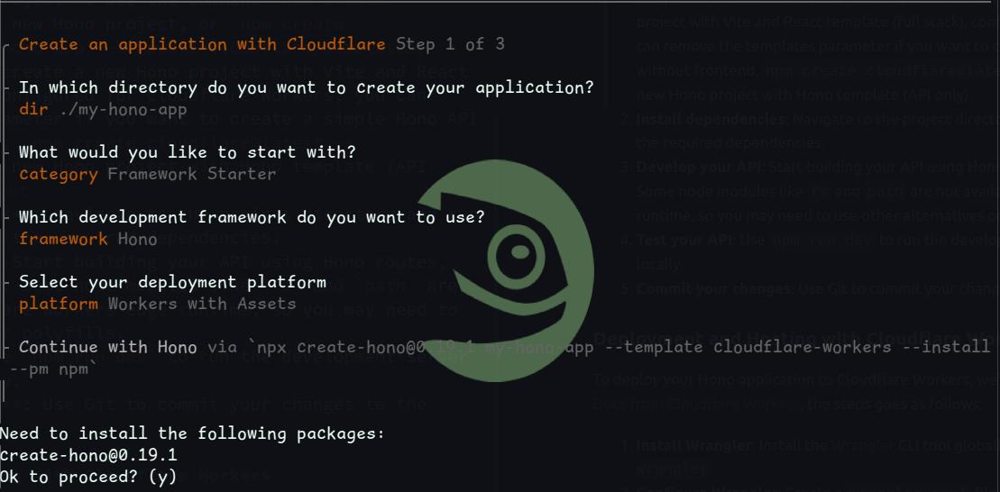

# Introduction

The pipeline will include development, hosting, and deployment. The best part is that you can do all of this for free just like how BOSC does it. We will be using the following tools and services:

### Frontend Development

- **Development**: GitHub [Astro](https://astro.build/)
- **Hosting**: GitHub Pages
- **Deployment**: GitHub Actions

### API Development

- **Development**: GitHub [Hono](https://hono.dev/docs/getting-started/basic)
- **CI/CD**: GitHub Actions
- **Hosting**: Cloudflare Workers
- **Deployment**: Wrangler
- **Database**: Cloudflare D1
- **Authentication**: OAuthv2

<br>

## Freely Available Frontend Hosting Options

As of 2025, there are several options available for hosting your frontend applications for free. Here are some of the most popular ones:

| SN  | Name         | Description                                                                                            |
| --- | ------------ | ------------------------------------------------------------------------------------------------------ |
| 1   | GitHub Pages | In GitHub pages you can use CNAME to point to your own custom domain. The repository has to be public. |
| 2   | Cloudflare   | Really good option, can take some time for newcomers to setup but it's easy.                           |
| 3   | Vercel       | You can connect your repository and deploy. Very easy to follow and can be done quickly.               |
| 4   | Netlify      | Similar process as in Vercel.                                                                          |
| 5   | Amazon S3    | A bit of hassle as you have to go through infra setup like setting up s3 bucket, setting up Route53.   |

## Freely Available API Hosting Options

As of 2025, there are several options available for hosting your API applications for free. Here are some of the most popular ones:

| SN  | Name       | Description                                                                              |
| --- | ---------- | ---------------------------------------------------------------------------------------- |
| 1   | Cloudflare | Free tier is available, you can use D1 for database and Workers for hosting.             |
| 2   | Vercel     | You can connect your repository and deploy. Very easy to follow and can be done quickly. |
| 3   | Netlify    | Similar process as in Vercel.                                                            |
| 4   | Railway    | Free tier is available, you can use PostgreSQL for database and deploy your API.         |
| 5   | Render     | Free tier is available, you can use PostgreSQL for database and deploy your API.         |

## Possible Frontend and API Development Options

You can use various frameworks and tools to develop your frontend and API applications. Here are some popular options that we're using at BOSC:

- With [Astro](https://docs.astro.build/en/install-and-setup/), you can create a new static site project. You can use the command `npm create astro@latest` to create a new Astro project.
- With [Hono](https://hono.dev/docs/getting-started/basic), you can create a new API project. You can use the command `npm create hono@latest` to create a new Hono project.
- With [React](https://react.dev/learn/creating-a-react-app), you can create a new React project. You can use the command `npx create-react-app my-app` to create a new React project.

## Frontend Pipeline with Astro

### Development

To develop a frontend application using Astro, you can follow these steps:

1. **Create a new Astro project**: Use the command `npm create astro@latest` to create a new Astro project.
2. **Install dependencies**: Navigate to the project directory and run `npm install` to install the required dependencies.
3. **Develop your application**: Start building your frontend application using Astro components, pages, and styles.
4. **Test your application**: Use `npm run dev` to run the development server and test your application locally.
5. **Commit your changes**: Use Git to commit your changes to the repository.

### Deployment and Hosting with GitHub Pages

To deploy your Astro application to GitHub Pages, you can follow these steps:

1. **Build your application**: Run `npm run build` to generate the static files for your Astro application.
2. **Setup GitHub Actions**: Create a `.github/workflows/deploy.yml` file in your repository with the following content:

```yaml
name: Deploy to GitHub Pages

on:
  # Trigger the workflow every time you push to the `main` branch
  # Using a different branch name? Replace `main` with your branch’s name
  push:
    branches: [main]
  # Allows you to run this workflow manually from the Actions tab on GitHub.
  workflow_dispatch:

# Allow this job to clone the repo and create a page deployment
permissions:
  contents: read
  pages: write
  id-token: write

jobs:
  build:
    runs-on: ubuntu-latest
    steps:
      - name: Checkout your repository using git
        uses: actions/checkout@v4
      - name: Install, build, and upload your site
        uses: withastro/action@v2
        # with:
        #path: ./astro # The root location of your Astro project inside the repository. (optional)
        #node-version: 20 # The specific version of Node that should be used to build your site. Defaults to 20. (optional)
        #package-manager: pnpm@latest # The Node package manager that should be used to install dependencies and build your site. Automatically detected based on your lockfile. (optional)

  deploy:
    needs: build
    runs-on: ubuntu-latest
    environment:
      name: github-pages
      url: ${{ steps.deployment.outputs.page_url }}
    steps:
      - name: Deploy to GitHub Pages
        id: deployment
        uses: actions/deploy-pages@v4
```

This is the basic workflow for deploying an Astro application to GitHub Pages. You can customize it further based on your requirements.

3. **Push your changes**: Commit and push your changes to the `main` branch of your repository. This will trigger the GitHub Actions workflow and deploy your Astro application to GitHub Pages.
4. **GitHub Settings**: Go to your repository settings, scroll down to the "Pages" section, and select `GitHub Actions` as the source for your GitHub Pages. Set the branch to `main ` or `gh-pages` and the folder to `/ (root)`. You can also set a custom domain if you have one.
5. **Access your deployed application**: Go to the Actions tab in your GitHub repository to monitor the deployment process. You can see the logs and status of the deployment. Once the deployment is complete, you can access your Astro application at `https://<username>.github.io/<repository-name>/`.

## API Pipeline with Hono

With Hono, we'll be using cloudflare free tier to host our API. The free tier allows you to use Cloudflare Workers and D1 database for free.

### Development

To develop an API application using Hono, you can follow these steps:

1. **Create a new Hono project**: Use the command `npm create hono@latest` to create a new Hono project, or `npm create cloudflare@latest -- my-hono-app --template=cloudflare/templates/vite-react-template` to create a new Hono project with Vite and React template (full stack), configured for Cloudflare Workers, you can remove the templates parameter if you want to create a simple Hono API project without frontend, `npm create cloudflare@latest -- my-hono-app --framework=hono` to create a new Hono project with Hono template (API only).
   1. 
   2. On category you can select the `Framework Starter` and select `Hono` option. You'll also be asked for Git setup and whether you want to deploy to cloudflare Workers, you can select `No` for now for the deployment part, we will do that later.
2. **Install dependencies**: Navigate to the project directory and run `npm install` to install the required dependencies.
3. **Develop your API**: Start building your API using Hono routes, middleware, and handlers. Some node modules like `fs` and `path` are not available in Cloudflare Workers edge runtime, so you may need to use other alternatives or polyfills.
4. **Test your API**: Use `npm run dev` to run the development server and test your API locally.
5. **Commit your changes**: Use Git to commit your changes to the repository.

### Deployment and Hosting with Cloudflare Workers

To deploy your Hono application to Cloudflare Workers, we'll be following the steps from [Hono Docs from Cloudflare Workers](https://developers.cloudflare.com/workers/frameworks/framework-guides/hono/), the steps goes as follows:

1. **Install Wrangler**: Install the [Wrangler](https://developers.cloudflare.com/workers/wrangler/install-and-update/) CLI tool globally using `npm install -g wrangler`.
2. **Configure Wrangler**: If you created the Hono project from the cloudflare template, the `wrangler.toml` or `wrangler.jsonc` file will already be created for you. If not, you can create a new `wrangler.jsonc` file in your project root with the following content:

```jsonc
/**
 * For more details on how to configure Wrangler, refer to:
 * https://developers.cloudflare.com/workers/wrangler/configuration/
 */
{
  "$schema": "node_modules/wrangler/config-schema.json",
  "name": "my-hono-app",
  "main": "src/index.ts",
  "compatibility_date": "2025-05-25",
  "assets": {
    "binding": "ASSETS",
    "directory": "./public",
  },
  "observability": {
    "enabled": true,
  },
  /**
   * Smart Placement
   * Docs: https://developers.cloudflare.com/workers/configuration/smart-placement/#smart-placement
   */
  // "placement": { "mode": "smart" },

  /**
   * Bindings
   * Bindings allow your Worker to interact with resources on the Cloudflare Developer Platform, including
   * databases, object storage, AI inference, real-time communication and more.
   * https://developers.cloudflare.com/workers/runtime-apis/bindings/
   */

  /**
   * Environment Variables
   * https://developers.cloudflare.com/workers/wrangler/configuration/#environment-variables
   */
  // "vars": { "MY_VARIABLE": "production_value" },
  /**
   * Note: Use secrets to store sensitive data.
   * https://developers.cloudflare.com/workers/configuration/secrets/
   */

  /**
   * Static Assets
   * https://developers.cloudflare.com/workers/static-assets/binding/
   */
  // "assets": { "directory": "./public/", "binding": "ASSETS" },

  /**
   * Service Bindings (communicate between multiple Workers)
   * https://developers.cloudflare.com/workers/wrangler/configuration/#service-bindings
   */
  // "services": [{ "binding": "MY_SERVICE", "service": "my-service" }]
}
```

3. **Login to Cloudflare**: Run `wrangler login` to authenticate your Cloudflare account.
4. **Publish your application**: Run `wrangler publish` to deploy your Hono application to Cloudflare Workers. This will upload your code and assets to Cloudflare and make your API available at a unique URL.
5. **Access your deployed API**: Once the deployment is complete, you can access your Hono API at `https://<your-worker-name>.<your-subdomain>.workers.dev/`. You can also set up a custom domain if you have one.

## Conclusion

With the above steps, you can set up a complete pipeline for developing, hosting, and deploying your frontend and API applications using free tools and services. BOSC has successfully implemented this pipeline to streamline its development process, and you can do the same for your projects. By leveraging GitHub Pages for frontend hosting and Cloudflare Workers for API hosting, you can create robust applications without incurring any costs.

## Additional Resources

- [Astro Documentation](https://docs.astro.build/en/)
- [Hono Documentation](https://hono.dev/docs/getting-started/basic)
- [GitHub Actions Documentation](https://docs.github.com/en/actions)
- [Cloudflare Workers Documentation](https://developers.cloudflare.com/workers/)
- [Wrangler Documentation](https://developers.cloudflare.com/workers/wrangler/)

## Reactjs Pipeline with Cloudflare Pages

If you prefer to use React for your frontend development, you can follow a similar pipeline using Cloudflare Pages. Here's how you can set it up:

### Development

To develop a React application using Cloudflare Pages, you can follow these steps:

1. **Create a new React project**: Use the command `npm create cloudflare@latest -- my-react-app --framework=react --platform=pages` to create a new React project, configured for Cloudflare Pages. This command will set up a new React project with the necessary configuration for deployment to Cloudflare Pages.
2. **Develop**: Start building your React application using components, hooks, and styles.
3. **Test your application**: Use `npm start` to run the development server and test your application locally.
4. **Commit your changes**: Use Git to commit your changes to the repository.

### Deployment and Hosting with Cloudflare Pages

To deploy your React application to Cloudflare Pages, you can follow these steps:

1. **Build your application**: Run `npm run build` to generate the static files for your React application.
2. **Push to GitHub**: Push your changes to a GitHub repository.
3. **Connect to Cloudflare Pages**: Go to the [Cloudflare Pages dashboard](https://pages.cloudflare.com/) and create a new project. Connect your GitHub repository to Cloudflare Pages.
4. **Configure build settings**: In the Cloudflare Pages settings, set the build command to `npm run build` and the output directory to `build`.
5. **Deploy your application**: Cloudflare Pages will automatically build and deploy your React application whenever you push changes to the connected GitHub repository.
6. **Access your deployed application**: Once the deployment is complete, you can access your React application at `https://<your-project-name>.pages.dev/`. You can also set up a custom domain if you have one.
